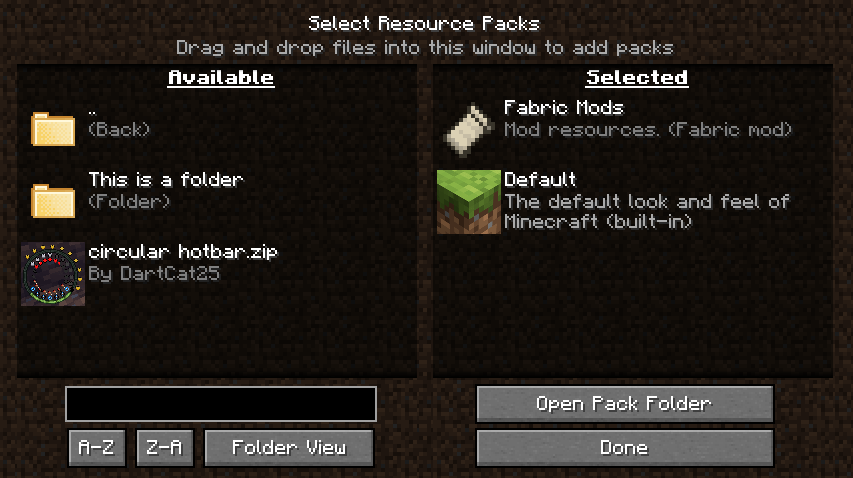

# Recursive Resources 

 
[![Modrinth](https://img.shields.io/badge/dynamic/json?color=158000&label=downloads&prefix=+%20&query=downloads&url=https://api.modrinth.com/api/v1/mod/CcL3MXyI&logo=data:image/svg+xml;base64,PHN2ZyB4bWxucz0iaHR0cDovL3d3dy53My5vcmcvMjAwMC9zdmciIHZpZXdCb3g9IjAgMCAxMSAxMSIgd2lkdGg9IjE0LjY2NyIgaGVpZ2h0PSIxNC42NjciICB4bWxuczp2PSJodHRwczovL3ZlY3RhLmlvL25hbm8iPjxkZWZzPjxjbGlwUGF0aCBpZD0iQSI+PHBhdGggZD0iTTAgMGgxMXYxMUgweiIvPjwvY2xpcFBhdGg+PC9kZWZzPjxnIGNsaXAtcGF0aD0idXJsKCNBKSI+PHBhdGggZD0iTTEuMzA5IDcuODU3YTQuNjQgNC42NCAwIDAgMS0uNDYxLTEuMDYzSDBDLjU5MSA5LjIwNiAyLjc5NiAxMSA1LjQyMiAxMWMxLjk4MSAwIDMuNzIyLTEuMDIgNC43MTEtMi41NTZoMGwtLjc1LS4zNDVjLS44NTQgMS4yNjEtMi4zMSAyLjA5Mi0zLjk2MSAyLjA5MmE0Ljc4IDQuNzggMCAwIDEtMy4wMDUtMS4wNTVsMS44MDktMS40NzQuOTg0Ljg0NyAxLjkwNS0xLjAwM0w4LjE3NCA1LjgybC0uMzg0LS43ODYtMS4xMTYuNjM1LS41MTYuNjk0LS42MjYuMjM2LS44NzMtLjM4N2gwbC0uMjEzLS45MS4zNTUtLjU2Ljc4Ny0uMzcuODQ1LS45NTktLjcwMi0uNTEtMS44NzQuNzEzLTEuMzYyIDEuNjUxLjY0NSAxLjA5OC0xLjgzMSAxLjQ5MnptOS42MTQtMS40NEE1LjQ0IDUuNDQgMCAwIDAgMTEgNS41QzExIDIuNDY0IDguNTAxIDAgNS40MjIgMCAyLjc5NiAwIC41OTEgMS43OTQgMCA0LjIwNmguODQ4QzEuNDE5IDIuMjQ1IDMuMjUyLjgwOSA1LjQyMi44MDljMi42MjYgMCA0Ljc1OCAyLjEwMiA0Ljc1OCA0LjY5MSAwIC4xOS0uMDEyLjM3Ni0uMDM0LjU2bC43NzcuMzU3aDB6IiBmaWxsLXJ1bGU9ImV2ZW5vZGQiIGZpbGw9IiM1ZGE0MjYiLz48L2c+PC9zdmc+)](https://modrinth.com/mod/recursiveresources)

An indirect port of the [Resource Pack Organiser](https://github.com/chylex/Resource-Pack-Organizer) mod to modern versions of Minecraft.

## Features

Recursive Resources is a mod that revamps the vanilla resource pack menu to be more user friendly with the addition of many Quality of Life features, such as:

- Organize resource pack into folders that you can navigate from within the game
- Choose between folder view (navigate in and out of folders) and flat view (packs from all folders shown in a single list)
- Search pack names and description (supports the `*` wildcard)
- Sort packs and folders alphabetically from A-Z or Z-A

## Screeenshots

## License

This mod is under the [Mozilla Public License](LICENSE), version 2.0
